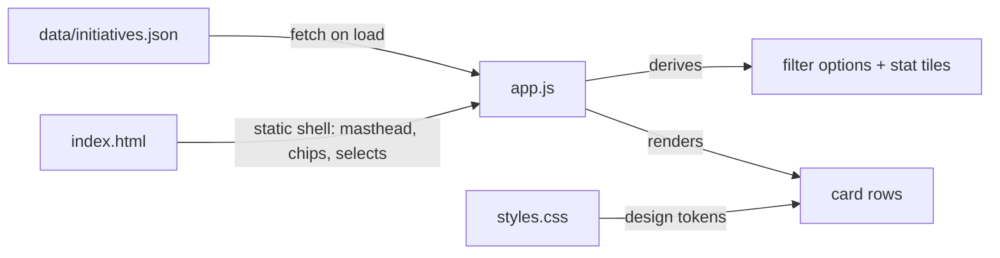

# Architecture overview

The site is three files with one direction of data flow:

## Boot sequence (`app.js`)

1. `init()` fetches `data/initiatives.json`. On failure (typically `file://` usage) it renders a hint to serve over HTTP.
2. `renderMeta()` and `renderStats()` fill the masthead date and the three stat tiles (active initiatives, verified count, distinct zones) — all **computed from the feed**, never hardcoded.
3. Category and zone `<select>` options are derived from the data (`categoriesIn`, `zonesIn`), so new values in the JSON appear in filters with zero code changes. Labels come from `CATEGORY_LABELS`; an unknown category still renders (falls back to its raw key).
4. `bindFilters()` wires audience chips, both selects, and the search box to a single `state` object; every change re-runs `renderCards()`.

## Filtering and ordering

`matches(item)` applies the four filters as an AND: audience membership, category equality, zone membership, and a substring search over title, summary, organizer, tags, needs, offers, zones, and category label. `renderCards()` then sorts by `verificationRank` — verified first, outdated last — so information freshness, not recency, is the ranking signal.

## Rendering

`cardEl()` builds each row with `document.createElement` (via the `el()` helper) — **no innerHTML with data content**, so feed text cannot inject markup. Each card is a 3-column grid (title+tags / meta / status+links) that collapses to one column under 880px.

## Design system (`styles.css`)

Editorial brand inspired by print-report layouts: soft cream ground, grotesque sans, hairline rules, and a yellow-green highlighter accent. Everything is a token on `:root`:

| Token | Value | Role |
|---|---|---|
| `--cream` | `#f5f1e8` | page background |
| `--ink` | `#141412` | primary text, filled chips |
| `--highlight` | `#e4ff54` | headline highlight, link underlines, dark-panel accent |
| `--panel-dark` | `#171714` | "propose an initiative" tile |
| `--ok` / `--pending` / `--stale` | greens/ambers/reds | verification badge colors (always paired with a text label, never color-alone) |

Verification badges are `status--verificada`, `status--por_verificar`, `status--desactualizada` classes — the class name is the `verification.state` value from the feed, so a new state needs both a CSS class and (optionally) a `VERIFICATION_LABELS` entry in `app.js`.
